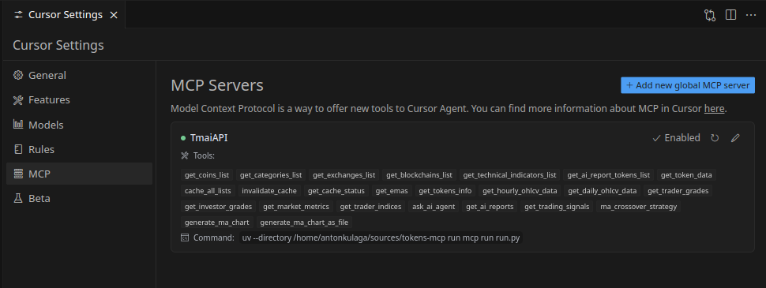

# Tokens MCP

MCP server for Token Metrics API.

## About

MCP (Model Control Protocol) provides a standardized interface for AI systems to access external tools and data sources. This repository implements an MCP server for TokenMetrics API, enabling you to:

- Access comprehensive cryptocurrency market data 
- Implement and backtest trading strategies (like moving average crossovers)
- Generate visual performance metrics for your strategies
- Analyze token performance across different timeframes
- Build automated trading systems with consistent API access

Whether for algorithmic trading bots or market research, this server simplifies working with crypto data and strategy development.

### Demo Video

[](https://www.youtube.com/watch?v=YrP_cEG037Y)

## Getting Started

### Installation

1. Clone the repository:
```bash
git clone https://github.com/antonkulaga/tokens-mcp.git
```

2. Install dependencies:

```bash
uv sync
```

### Configuration

Copy `.env.example` to `.env` and configure your API keys:

```bash
cp .env.example .env
# Edit .env with your TokenMetrics API key
```

You must also update the `mcp_server_config.json` file with your TokenMetrics API key:

```json
{
  "mcpServers": {
    "TmaiAPI": {
      "command": "uv",
      "args": ["--directory", "/path/to/tokens-mcp", "run", "mcp", "run", "run.py"],
      "env": {
        "TOKEN_METRICS_API_KEY": "your-api-key-here"
      }
    }
  }
}
```

### Running the Server

```bash
uv run mcp run run.py
```

You can inspect the server by running
```bash
uv run mcp dev run.py
```

Note: if uv environment is activated you can omit uv run part


## IDE Integration

This project works best with IDEs that support the Model Context Protocol (MCP). 

### Cursor

[Cursor](https://docs.cursor.com/context/model-context-protocol) provides native support for MCP, allowing AI assistants to directly interact with the TokenMetrics API through this server. To use this project in Cursor:

1. Open the project in Cursor
2. Ensure your configuration files (.env and mcp_server_config.json) are properly set up
3. The MCP server will be automatically detected, enabling AI assistants to analyze crypto data and implement trading strategies



## Project Structure

The project is organized using a standard Python package structure:

```
tokens-mcp/
├── src/                           # Source code directory
│   └── tokens_mcp/                # Main package
│       ├── __init__.py            # Package initialization
│       ├── server.py              # MCP server implementation
│       ├── models.py              # Pydantic models
│       ├── helpers.py             # Helper functions
│       ├── chart_utils.py         # Chart utilities
│       ├── check_api_access.py    # API access validation
│       ├── save_and_decode_chart.py # Chart handling utilities
│       ├── inspect_exchange.py    # Exchange inspection utilities
│       └── inspect_api.py         # API inspection utilities
├── tests/                         # Test directory
│   ├── test_token_symbols.py      # Token symbol tests
│   ├── test_pagination.py         # Pagination tests
│   ├── test_ma_chart.py           # Moving average chart tests
│   ├── test_cache.py              # Cache tests
│   └── ...                        # Other tests
├── run.py                         # Server runner script
├── pyproject.toml                 # Project configuration
├── mcp_server_config.json         # Server configuration
├── notebooks/                     # Jupyter notebooks
├── images/                        # Image resources
└── README.md                      # This file
```

## Known Issues

### Configuration File Paths

The `mcp_server_config.json` file currently contains absolute paths to the server. You must manually edit this file to update the path to match your local environment:

```json
{
  "mcpServers": {
    "TmaiAPI": {
      "command": "uv",
      "args": ["--directory", "/path/to/tokens-mcp", "run", "mcp", "run", "run.py"],
                              ^^^^^^^^^^^^^^^^^^^ 
                              Update this to your actual path
      "env": {
        "TOKEN_METRICS_API_KEY": "your-api-key-here"
      }
    }
  }
}
```

This is a temporary limitation that will be addressed in future updates.

### Testing Framework

Currently, the test files in the `tests/` directory are manually run scripts rather than proper pytest files with assertions. These scripts are used to verify functionality through manual inspection of outputs rather than automated test assertions. Future updates will implement proper pytest-based testing with complete assertion coverage.

### TokenMetrics API Implementation

Many TokenMetrics API endpoints had to be directly implemented in this project because they are not available in the existing tmai-api library. This results in some custom API handling code that would ideally be part of the upstream library. Future updates may migrate these implementations to the official library or create a more comprehensive client package.

### Experimental Code

This repository may contain traces of unused code that was previously used for experimentation and development iterations. These code fragments remain for reference purposes but may be removed in future cleanup efforts. If you encounter seemingly unused functions or modules, they likely fall into this category.

## Project Background

This repository serves as a demo for the HolyMCP project developed at the Bucharest ETH 2025 Hackathon.


